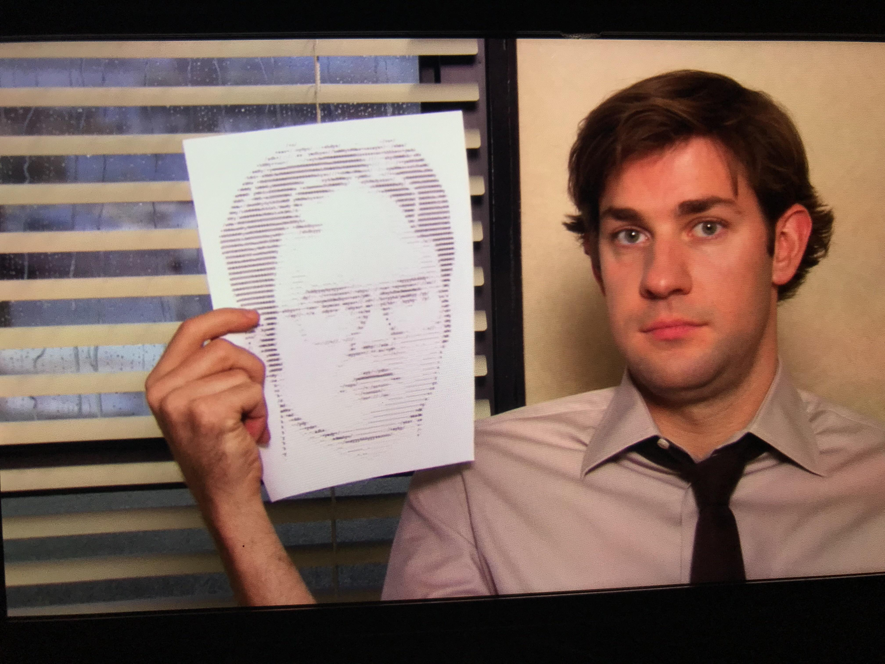
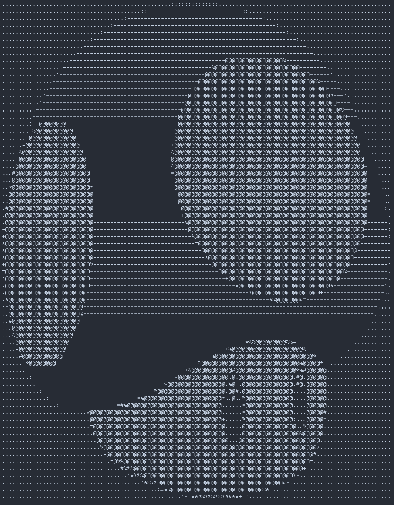
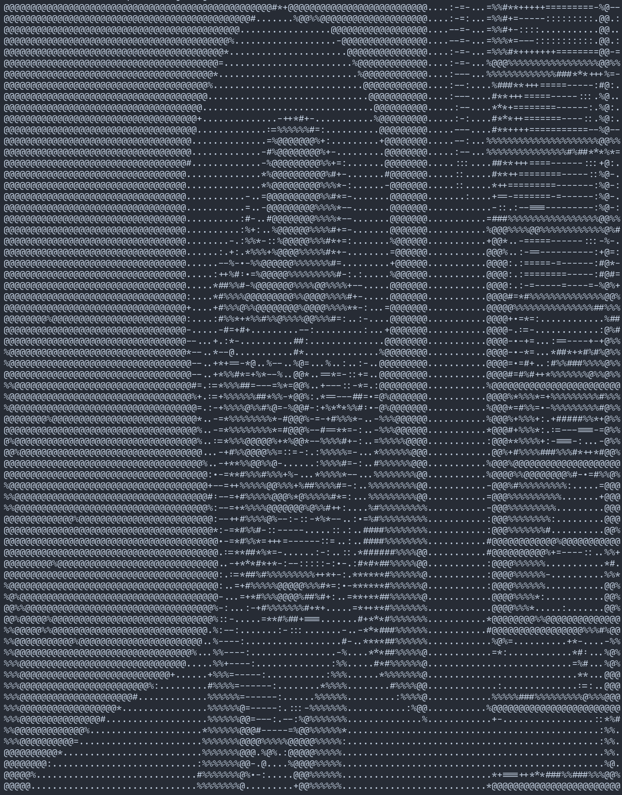
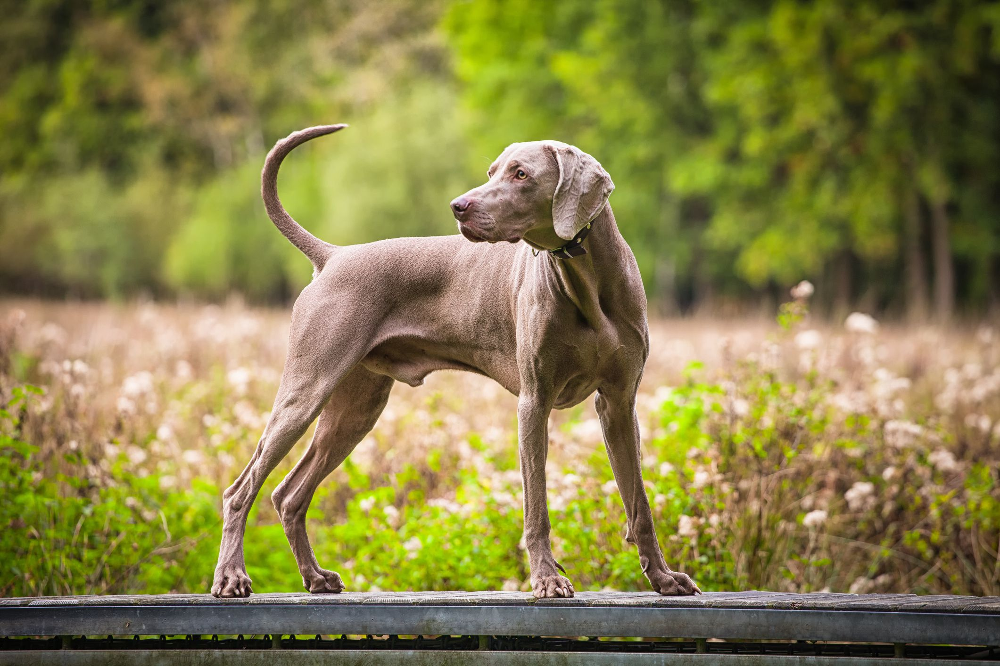
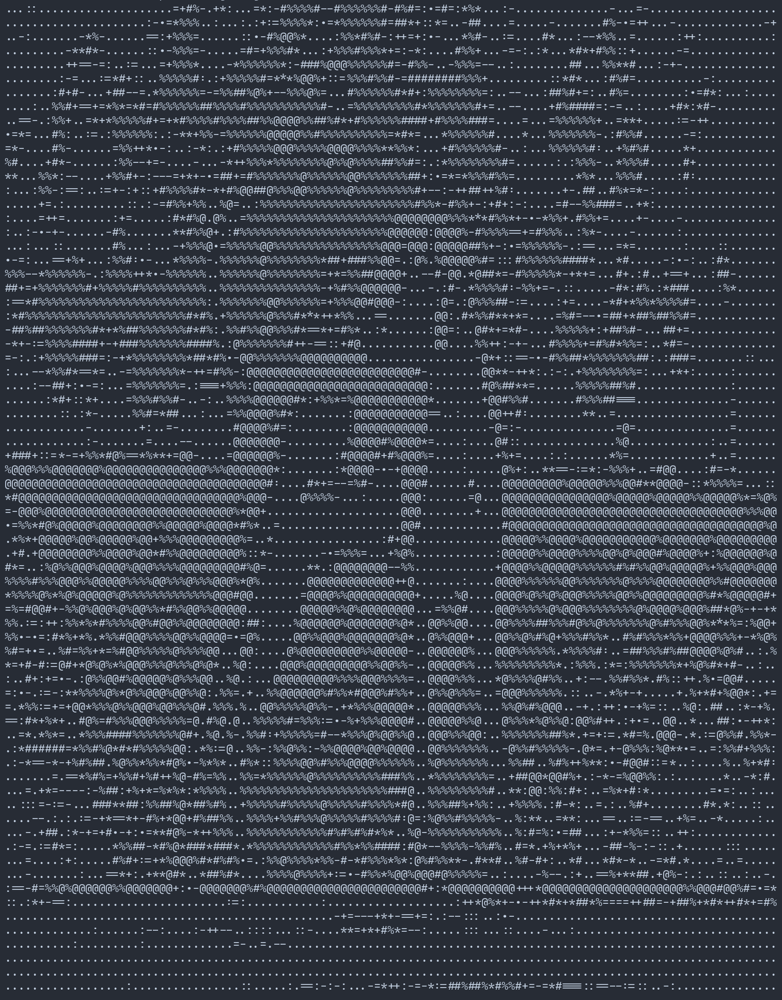

# IMG2ASCI

Simple images convertor to ASCI ART inspired by The Office episode.



## Examples
|                                       |                                           |
| --------------------------------------|-------------------------------------------|
|      |     |
|     |     |
|     |     |


## Usage
```
NAME:
   img2asci - ASCI ART converter

USAGE:
   main [global options] command [command options] [arguments...]

DESCRIPTION:
   Simple but yet very powerfull converter from ordinary, plain images to beatiful ASCI art

AUTHOR:
   M. Więcek

COMMANDS:
   help, h  Shows a list of commands or help for one command

GLOBAL OPTIONS:
   --width value, --wx value         width of output image  (default: 80)
   --height value, --hx value        width of output image (default: 0)
   --sharp value, --vs value         preprocessing sharpening value (default: 5)
   --bright value, --vb value        preprocessing bright value (default: 5)
   --contrast value, --vc value      preprocessing contrast value (default: 75)
   --outputFilePath value, -o value  name of output file (default: "./output.txt")
   --grayScaleAsciTable value        override gray scale with ASCI characters (default: ".:-=+*#%@")
   --term, -t                        if print to term (default: false)
   --help, -h                        show help (default: false)
```
